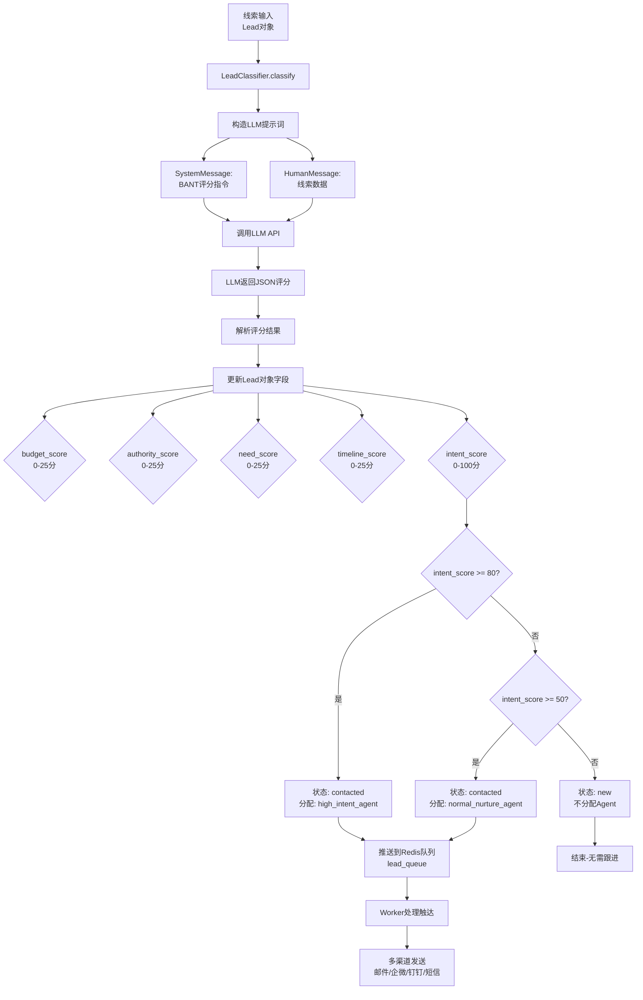

# BANT 评分流程

## 流程图



## 评分维度说明

| 维度 | 字段名 | 分值范围 | 说明 |
|------|--------|----------|------|
| **B**udget（预算） | `budget_score` | 0-25 | 客户是否有预算支持采购 |
| **A**uthority（决策权） | `authority_score` | 0-25 | 联系人是否有决策权 |
| **N**eed（需求） | `need_score` | 0-25 | 客户需求的强烈程度 |
| **T**imeline（时间线） | `timeline_score` | 0-25 | 客户期望的购买时间 |
| **Intent**（意向总分） | `intent_score` | 0-100 | 四维度之和 |

## 路由规则

```python
# 评分后的路由逻辑（app/agents/classifier.py:132-140）
if lead.intent_score >= 80:
    lead.status = LeadStatus.CONTACTED
    lead.assigned_agent = "high_intent_agent"
elif 50 <= lead.intent_score < 80:
    lead.status = LeadStatus.CONTACTED
    lead.assigned_agent = "normal_nurture_agent"
else:
    lead.status = LeadStatus.NEW
    lead.assigned_agent = None
```

## LLM 提示词示例

```python
system_msg = SystemMessage(content=(
    "You are a sales-lead classifier using the BANT framework. "
    "Score each component (Budget, Authority, Need, Timeline) "
    "on a 0-25 scale and a total Intent (0-100). "
    "Return ONLY a valid JSON object, no extra text."
))

human_msg = HumanMessage(content=(
    f"Lead data:\n"
    f"company_name={lead.company_name}\n"
    f"raw_content={lead.raw_content}\n"
    "Provide JSON with keys: budget, authority, need, timeline, intent."
))
```

## LLM 返回示例

```json
{
  "budget": 20,
  "authority": 22,
  "need": 25,
  "timeline": 18,
  "intent": 85
}
```

## 完整处理流程

```
1. 线索录入
   └─ 通过 API POST /leads 或数据库导入
   └─ 创建 Lead 对象（包含 raw_content 等）

2. 评分阶段（LeadClassifier.classify）
   └─ 调用 LLM API（DeepSeek/OpenAI/Anthropic）
   └─ LLM 根据 raw_content 分析 BANT 各维度
   └─ 返回 JSON 格式评分

3. 路由阶段（LeadRouter.route）
   └─ ≥80分 → high_intent_agent → 立即触达
   └─ 50-79分 → normal_nurture_agent → 培育跟进
   └─ <50分 → 不分配 → 待定

4. 队列处理（LeadService.process_lead）
   └─ 推送到 Redis lead_queue
   └─ Worker 异步处理
   └─ OutreachAgent 执行多渠道触达

5. 触达执行（OutreachAgent.execute）
   └─ 邮件（LLM 生成个性化内容）
   └─ 企业微信（LLM 生成个性化消息）
   └─ 钉钉（LLM 生成个性化消息）
   └─ 短信（模板发送）
```
